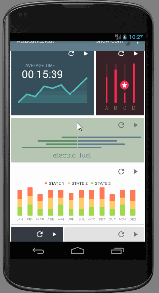
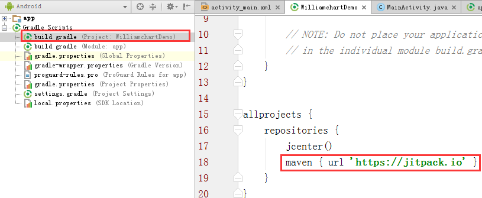

# WilliamChart项目使用

开源地址：[https://github.com/open-android/WilliamChart](https://github.com/open-android/WilliamChart "https://github.com/open-android/WilliamChart")

# 运行效果

* 更多干货请下载app

## 使用步骤

### 1. 在project的build.gradle添加如下代码(如下图)

	allprojects {
	    repositories {
	        maven { url "https://jitpack.io" }
	    }
	}

### 2. 在Module的build.gradle添加依赖

    compile 'com.github.open-android:WilliamChart:v2.4.0'

### 3.布局文件使用

	<com.db.chart.view.LineChartView
	    android:id="@+id/chart"
	    app:chart_axisColor="#30547d99"
	    android:layout_width="match_parent"
	    android:layout_height="match_parent"
	    android:layout_centerHorizontal="true"
	    android:layout_marginTop="23dp" />

### 4.Activity初始化

 	mChart = (LineChartView) findViewById(R.id.chart);

    LineSet dataset = new LineSet(mLabels, mValues[0]);
    //...省略部分代码，请参考mobile中事例
    mChart.addData(dataset);//设置数据

    mChart.show();//显示
	
* 详细的使用方法在DEMO里面都演示啦,如果你觉得这个库还不错,请赏我一颗star吧~~~

* 欢迎关注微信公众号

	

	
